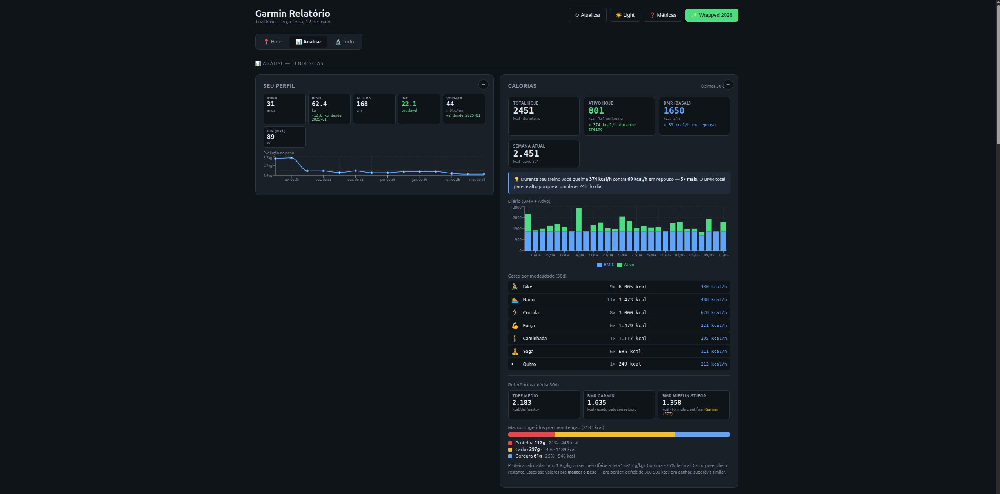

# Garmin Relatório — Dashboard de Triathlon

Dashboard **local** pra acompanhar evolução em natação, bike e corrida — com **risco de lesão** (ACWR), **detecção de overtraining**, **adesão ao treino prescrito pelo coach**, **análise técnica de natação**, previsão de provas e muito mais.

> Funciona com **Garmin**, **Strava** ou arquivos **.fit** soltos. Você não precisa ter Garmin — veja a [tabela de compatibilidade](#fontes-de-dados) abaixo.



---

## Sumário

- [Por que existe](#por-que-existe)
- [Fontes de dados](#fontes-de-dados)
- [Setup rápido](#setup-rápido)
- [Setup completo](#setup-completo)
- [Uso diário](#uso-diário)
- [O que o dashboard mostra](#o-que-o-dashboard-mostra)
- [Metodologia](#metodologia-das-métricas-chave)
- [Automação do ingest](#automação-do-ingest-diário)
- [Estrutura](#estrutura)
- [Avisos](#avisos)

---

## Por que existe

Apps oficiais (Garmin Connect, Strava) mostram a atividade do dia, mas **não cruzam métricas no tempo** nem usam modelos validados academicamente pra apontar risco de lesão / overtraining. Este dashboard:

1. **Calcula ACWR** (Acute:Chronic Workload Ratio, Gabbett 2016) — relação carga semanal × carga 4 semanas, indicador conhecido de risco de lesão.
2. **Detecta overtraining** combinando HRV, FC repouso, sono curto consecutivo e sleep score.
3. **Mostra adesão ao plano do coach** (quando o coach prescreve treinos via Treius/Garmin Connect Workouts).
4. **Analisa técnica de natação** (DPS, SWOLF, cadência, pace puro) com tendência ao longo das últimas N sessões.
5. **Compara performance** (PMC, VDOT, race readiness, year-over-year).
6. Tudo **rodando localmente** — seus dados não saem do seu computador.

---

## Fontes de dados

O backend aceita **4 fontes** que podem coexistir (dedup automático por timestamp + duração + distância). Veja o que cada uma habilita:

| Card / métrica                         | Garmin live | Garmin GDPR export | Strava | `.fit` manual |
|----------------------------------------|:-----------:|:------------------:|:------:|:------------:|
| Volume semanal, ACWR, pace evolution   | ✅          | ✅                 | ✅     | ✅           |
| Calendário (heatmap)                   | ✅          | ✅                 | ✅     | ✅           |
| Predição Riegel                        | ✅          | ✅                 | ✅     | ✅           |
| Distribuição Z1-Z5 (precisa HR)        | ✅          | ✅                 | ✅ *   | ⚠️           |
| Personal Records                       | ✅          | ✅                 | ✅     | ⚠️           |
| Performance Management (PMC)           | ✅          | ✅                 | ✅     | ✅           |
| **Sono, HRV, FC repouso, Body Battery**| ✅          | ✅                 | ❌     | ❌           |
| **VO2max, Garmin race predictions**    | ✅          | ✅                 | ❌     | ❌           |
| **Adesão a treino prescrito (coach)**  | ✅          | ⚠️                 | ❌     | ❌           |
| **Análise técnica de natação**         | ✅          | ✅                 | ⚠️ **  | ⚠️           |
| Temperatura nos treinos                | ✅          | ✅                 | ❌     | ⚠️           |
| Ciclo menstrual & performance          | ❌ ***      | ✅                 | ❌     | ❌           |

\* Se você usa monitor de FC integrado com Strava (cinta, relógio, etc), os dados vêm no ingest.
\** Strava raramente carrega métricas de piscina (SWOLF/DPS) — depende do dispositivo de origem.
\*** API live do Garmin não expõe menstrual data — só o export GDPR traz.

### Fontes complementares

| Card / métrica                            | Fonte                                                      |
|-------------------------------------------|------------------------------------------------------------|
| **Composição corporal** (peso, gordura %, músculo %, água, gordura visceral, BMR) | **Zepp Life** (export CSV) — funciona com Mi Body Composition Scale 2 e demais balanças Xiaomi/Amazfit |
| **Status das fontes de dados**            | metaview interna (não precisa ingest) — mostra cobertura e quando atualizar cada fonte |

**Conclusão prática:**
- **Tem Garmin?** Use **Garmin GDPR export** pra carga inicial (1 zip, anos de histórico) + **Garmin live** pra atualizar.
- **Não tem Garmin?** Use **Strava**. Você perde sono/HRV/VO2max, mas ganha tudo o que envolve só as atividades.
- **Tem .fit soltos?** Joga em `backend/data/exports/` e roda `ingest-fit`.
- **Tem balança de bioimpedância Xiaomi/Amazfit?** Exporte via Zepp Life e adicione **composição corporal** ao dashboard (peso + gordura % + músculo % + visceral + BMR ao longo do tempo, com bandas-alvo).

---

## Setup rápido

Caminho mínimo pra ver o dashboard funcionando (qualquer fonte serve):

```bash
# 1. Clone e instale
git clone https://github.com/MicaelaAndrade/garmin-relatorio.git
cd garmin-relatorio

# 2. Backend
cd backend && uv sync && cp ../.env.example ../.env
# edite o .env conforme a sua fonte de dados (Garmin OU Strava)

# 3. Frontend
cd ../frontend && pnpm install

# 4. Ingest os seus dados (ver Setup completo)
cd ../backend
uv run garmin-relatorio ingest-garmin     # se Garmin
# OU
uv run garmin-relatorio ingest-strava     # se Strava (precisa OAuth, veja abaixo)

# 5. Sobe API + frontend em terminais separados
uv run garmin-relatorio serve --reload    # http://localhost:8000
cd ../frontend && pnpm dev                # http://localhost:5173
```

Abre [http://localhost:5173](http://localhost:5173).

---

## Setup completo

### Garmin live (API)

```bash
# .env
GARMIN_EMAIL=seu-email@example.com
GARMIN_PASSWORD=sua-senha
```

```bash
cd backend
uv run garmin-relatorio ingest-garmin --days 90
```

> Logins frequentes podem bloquear sua conta temporariamente. A lib cacheia sessão em `backend/data/garmin_session/` — não delete esse diretório.

### Garmin GDPR Export (recomendado pra carga inicial)

1. Acesse [garmin.com/account/datamanagement/exportdata](https://www.garmin.com/account/datamanagement/exportdata)
2. Clique em "Request Data Export". Em ~24h chega um email com link do ZIP (anos de histórico).
3. Extraia o ZIP.
4. No `.env`:
   ```bash
   GARMIN_EXPORT_DIR=/caminho/para/DI_CONNECT
   ```
5. Carrega tudo:
   ```bash
   cd backend
   uv run garmin-relatorio ingest-export
   ```

Esse ingest carrega **muito mais** que a API live: VO2max histórico, race predictions calculadas pelo FirstBeat, métricas diárias (UDS), sono completo, dados menstruais — sem precisar logar de novo.

### Strava

1. Acesse [strava.com/settings/api](https://www.strava.com/settings/api)
2. Crie um app:
   - Application name: `garmin-relatorio` (qualquer nome)
   - Authorization Callback Domain: `localhost`
3. Copie `Client ID` e `Client Secret` pro `.env`:
   ```bash
   STRAVA_CLIENT_ID=12345
   STRAVA_CLIENT_SECRET=abc123...
   ```
4. Autorize:
   ```bash
   cd backend
   uv run garmin-relatorio strava-auth
   ```
   Abre o navegador. Após autorizar, o token fica em `backend/data/strava_token.json` e o refresh é automático.
5. Ingest:
   ```bash
   uv run garmin-relatorio ingest-strava --days 90
   ```

### Arquivos `.fit` soltos

Coloca os `.fit` em `backend/data/exports/` e roda:

```bash
uv run garmin-relatorio ingest-fit
```

Útil pra usuários de Polar, Coros, Suunto, ou quando você baixou activities individuais.

### Zepp Life (Mi Body Composition Scale 2 e similares)

Quem tem balança de bioimpedância da Xiaomi/Amazfit que sincroniza com o app **Zepp Life** (ou Mi Fit antigo): dá pra exportar todo o histórico e plotar evolução de **peso, gordura %, músculo %, água %, gordura visceral, massa óssea e BMR** no dashboard.

1. No app Zepp Life: **Perfil** → **Configurações** → **Conta Mi Fitness** → **Sobre** → **Exportar dados**.
2. Aguarde o email com link do ZIP (geralmente alguns minutos).
3. Baixa e descompacta. Vai gerar um diretório tipo `3312646638_xxxxx/` com subpastas (`BODY/`, `SLEEP/`, `HEARTRATE/`, etc).
4. Roda o ingest apontando pra esse diretório:
   ```bash
   cd backend
   uv run garmin-relatorio ingest-zepp ~/Downloads/3312646638_xxxxx
   ```

O ingest é **idempotente** (rodar de novo só adiciona o que for novo) e usa apenas a pasta `BODY/`. Outras subpastas do export Zepp são ignoradas por enquanto — se você usa Garmin pra atividades/sono/HR, ele já cobre isso melhor.

**Frequência recomendada:** exportar 1x por mês (ou mais frequente se pesa todo dia). Quando os dados ficarem >30 dias velhos, o card "Status das fontes de dados" sinaliza ⚠ e mostra o comando exato pra atualizar.

---

## Uso diário

```bash
cd backend

# Atualização incremental (recomendado 1x ao dia, mais detalhes em Automação)
uv run garmin-relatorio cron-ingest --days 7

# Ou manual, por fonte:
uv run garmin-relatorio ingest-garmin
uv run garmin-relatorio ingest-strava --days 7
```

Dashboard:

```bash
# Terminal 1 — API
cd backend && uv run garmin-relatorio serve --reload

# Terminal 2 — frontend
cd frontend && pnpm dev
```

Abre [http://localhost:5173](http://localhost:5173).

---

## O que o dashboard mostra

O dashboard tem **3 abas**: `Hoje` (resumo do dia), `Análise` (gráficos longitudinais), `Tudo` (vista única).

### Hoje (resumo rápido)

| Card | O que mostra |
|------|--------------|
| **Seu perfil** | Idade, peso, altura, IMC, VO2max, FCmax + evolução do peso |
| **Calorias** | TDEE, gasto ativo, BMR, macros sugeridos, gráfico diário 30d, gasto por modalidade |
| **Semana atual** | Sessões + km + min da semana corrente, separado por modalidade |
| **Risco de lesão (ACWR)** | Razão carga 7d/28d com zona ótimo/moderado/alto |
| **Overtraining detector** | Score 0–4 multi-métrica (HRV + RHR + sleep score + sono curto consecutivo) |
| **Sono e recuperação** | Horas das últimas 3 noites + flag de readiness |
| **Coach (Treius/Garmin)** | Treinos prescritos pelo coach com adesão ✅ por modalidade (run/bike/swim) |
| **Composição corporal** | Peso, gordura %, músculo %, água %, gordura visceral, BMR — com bandas-alvo + tendência (via Zepp Life) |
| **Atividades recentes** | Últimas 20 com pace, FC, distância, duração |

### Análise (evolução)

| Card | O que mostra |
|------|--------------|
| **Volume semanal** | Gráfico empilhado por modalidade últimas ~12 semanas |
| **VO2max** | Valor atual + curva 1 ano |
| **Zonas Z1-Z5 por modalidade** | Tempo em zona run/bike/swim + índice de polarização (80/20 vs zona cinza) |
| **Pace evolution** | Pace mensal por modalidade ao longo do ano |
| **Calendário (heatmap)** | Grade estilo GitHub colorida por carga TRIMP diária 180 dias |
| **Personal records** | PRs ordenados por relevância pra triathlon |
| **Predição Riegel × Garmin** | Tempo estimado em 5k/10k/21k/42k comparando Riegel vs FirstBeat |
| **Race Day Plan** | Pra cada prova cadastrada: countdown, fase (base/build/peak/taper), predição, fueling sugerido |
| **VDOT (Daniels)** | Tabela com paces de treino calculados a partir da sua melhor performance recente |
| **Performance Management (PMC)** | CTL/ATL/TSB ao longo do tempo (Banister/Coggan model) |
| **Sleep detail + Sleep debt** | Sono detalhado por fase + débito acumulado |
| **Wellness** | RHR baseline, HRV trend, BodyBattery, stress |
| **Year-over-Year** | Comparação mês corrente vs mesmo período ano passado (esconde quando histórico insuficiente) |
| **Temperatura nos treinos** | Scatter HR × temperatura — mostra impacto do calor |
| **Cycle performance** | Performance por fase do ciclo menstrual (folicular/lutea/menstrual/ovulatória) — opt-in |
| **Evolução técnica · Natação** | Histórico de DPS, SWOLF, cadência, pace puro das últimas 12 sessões + tendências + insights |
| **Status das fontes de dados** | Cobertura por fonte (Garmin / Zepp / Strava) com semáforo de quando atualizar e comando sugerido |

### Coach workout adherence

O card **"Treinos prescritos (coach)"** lê os workouts agendados pelo coach (via Treius ou outro app que use o sistema oficial de Workouts do Garmin Connect) e cruza com as atividades executadas:

- **Status por treino**: Completo / Quase completo / Parcial / Apenas iniciado / Executado
- **Comparação com prescrito**: duração, distância, pace/velocidade
- **Métricas sport-aware**:
  - **Run**: pace em mm:ss/km, cadência em passos/min
  - **Swim**: pace em mm:ss/100m, SWOLF, braçadas, cadência stroke/min, tamanho da piscina
  - **Bike**: velocidade em km/h, cadência rpm, potência (se houver)
- **Fueling sugerido**: hidratação, carbo/h, sódio/h calculado por modalidade e duração
- **Análise técnica de natação** (no expand): DPS, SWOLF, cadência, pace puro com ratings ✅⚠️❌ + tips heurísticos + checklist de técnica

---

## Metodologia das métricas-chave

### ACWR (Acute:Chronic Workload Ratio)

- **Carga** = duração (min) × fator de zona FC (TRIMP simplificado, calibrado com suas zonas Z1-Z5 reais quando disponíveis, fallback genérico caso contrário)
- **Aguda** = média móvel 7 dias
- **Crônica** = média móvel 28 dias
- **ACWR** = aguda ÷ crônica

| Zona      | Faixa     | Significado |
|-----------|-----------|-------------|
| Destreino | < 0.8     | Carga baixa demais — perde adaptação |
| Ótimo     | 0.8–1.3   | Sweet spot, progresso seguro |
| Moderado  | 1.3–1.5   | Cuidado, considere recuperação |
| **Alto**  | **> 1.5** | **Risco elevado de lesão** |

Referências: Gabbett TJ. *The training-injury prevention paradox*. BJSM 2016. Hulin BT et al. BJSM 2014.

### Riegel para predição de prova

`T2 = T1 × (D2/D1)^1.06`

Confiança alta quando D2 está dentro de ±20% da distância base. Pra extrapolações maiores (ex: 5k → maratona), o expoente precisa ajuste — toma como aproximação. Quando há VO2max disponível (Garmin), a predição **FirstBeat** sai lado a lado como segunda opinião.

### Overtraining (score 0–4)

Soma 1 ponto pra cada flag:
- HRV (últimas 3 noites) abaixo de baseline × 0.85
- FC repouso (últimos 3 dias) acima de baseline + 5 bpm
- Sleep score médio (últimas 3 noites) < 60
- 2+ noites consecutivas < 6.5h

`0` = verde · `1` = amarelo · `2+` = vermelho.

### Análise técnica de natação

- **DPS** (Distance Per Stroke) = `pool_length_m / avg_strokes_per_length`. Quanto maior, mais eficiente.
- **SWOLF** = strokes + tempo (segundos) por length. Quanto menor, mais eficiente.
- **Cadência** (stroke rate) = braçadas por minuto.
- **Pace puro** = `moving_duration / distance` (descontando descansos das séries).
- **Tendência** = média das últimas 4 sessões vs 4 anteriores.

Bandas-alvo (piscina 25m, triatleta amadora):

| Métrica       | Ótimo | Bom      | Atenção  | Melhorar |
|---------------|-------|----------|----------|----------|
| DPS           | ≥ 2.0 | 1.7–2.0  | 1.4–1.7  | < 1.4    |
| SWOLF         | < 36  | 36–42    | 42–50    | ≥ 50     |
| Cadência      | ≥ 32  | 28–32    | 24–28    | < 24     |

---

## Automação do ingest diário

Pra rodar 1x/dia sem clicar nada, três opções em `scripts/`:

### Opção A — systemd user timer (recomendado em Linux)

```bash
bash scripts/install-systemd-timer.sh
```

Instala em `~/.config/systemd/user/`, roda todo dia 07:00 (jitter de 30min). Logs em `backend/data/cron.log` + `journalctl --user -u garmin-relatorio-ingest.service`.

### Opção B — crontab

```cron
0 7 * * * $HOME/Documentos/garmin-relatorio/scripts/garmin-relatorio-cron.sh >> $HOME/Documentos/garmin-relatorio/backend/data/cron.log 2>&1
```

### Opção C — manual

```bash
cd backend
uv run garmin-relatorio cron-ingest --days 7
```

O wrapper pula automaticamente fontes sem credencial (Garmin, Strava) e nunca aborta a sequência por uma falha individual. Útil pra ambientes mistos onde só Garmin (ou só Strava) está configurado.

---

## Estrutura

```
garmin-relatorio/
├── .env                       # credenciais (não comita)
├── .env.example
├── docs/
│   └── screenshots/           # prints do dashboard
├── backend/
│   ├── pyproject.toml
│   ├── data/
│   │   ├── garmin.db          # SQLite (gerado)
│   │   ├── strava_token.json  # OAuth (gerado)
│   │   └── exports/           # .fit manuais
│   └── src/garmin_relatorio/
│       ├── config.py          # carrega .env
│       ├── db.py              # schema SQLite
│       ├── cli.py             # entry point
│       ├── ingest/
│       │   ├── garmin.py      # python-garminconnect
│       │   ├── garmin_export.py # parser GDPR
│       │   ├── strava.py      # stravalib + OAuth
│       │   ├── fit_files.py   # fitparse
│       │   ├── mfit.py        # rotinas de fortalecimento via PDF
│       │   └── cron_ingest.py # wrapper diário
│       ├── analysis/
│       │   ├── volume.py
│       │   ├── acwr.py        # risco lesão
│       │   ├── recovery.py    # sono + readiness
│       │   ├── performance.py # Riegel
│       │   ├── coach.py       # workout adherence (com fallback por data+sport)
│       │   ├── swim_technique.py # DPS/SWOLF/cadência ao longo do tempo
│       │   ├── overtraining.py
│       │   ├── calories.py    # TDEE, BMR, macros
│       │   ├── performance_mgmt.py # PMC
│       │   ├── vdot.py        # Daniels
│       │   ├── races.py       # race day plan
│       │   └── ... (mais 15 módulos)
│       └── api/main.py        # FastAPI
└── frontend/
    ├── package.json
    └── src/
        ├── App.tsx
        ├── api/client.ts      # tipos + fetch
        └── components/
            ├── CoachScheduleCard.tsx
            ├── SwimTechniqueCard.tsx
            ├── PerformanceMgmtCard.tsx
            └── ... (~25 cards)
```

---

## Roadmap

- [x] Tabela de atividades recentes
- [x] Zonas de FC personalizadas (extraídas do export)
- [x] Detecção de overtraining (HRV + RHR + sleep)
- [x] Calendário visual de carga
- [x] Comparação Riegel × Garmin
- [x] Personal records
- [x] Automatizar ingest com cron (1x/dia)
- [x] Plano semanal sugerido baseado em ACWR
- [x] Cycle phase tracker
- [x] Gráfico de pace por modalidade ao longo do tempo
- [x] Distribuição Z1-Z5 por treino
- [x] Ingest dos treinos prescritos pelo coach (Treius)
- [x] Importar rotina de fortalecimento (PDF MFit)
- [x] Coach adherence pra swim e bike (não só run)
- [x] Análise técnica de natação (DPS, SWOLF, tendências)
- [x] Performance Management (PMC), VDOT, Race Readiness, Sleep debt, Temperature trend, Year-over-Year
- [x] Composição corporal via balança Zepp Life / Mi Body Composition Scale 2
- [x] Status das fontes de dados (lembrete de quando atualizar cada fonte)
- [ ] Export PDF do relatório mensal
- [ ] Modo "demo" com dados sintéticos pra quem clonar sem fonte conectada
- [ ] Log manual de cargas no fortalecimento (input semanal + gráfico por exercício)

---

## Avisos

- A lib `python-garminconnect` é **não oficial** (Garmin não publica API pública). Funciona bem mas pode quebrar se Garmin mudar o backend deles.
- Login excessivo no Garmin pode bloquear a conta temporariamente. A lib cacheia sessão em `backend/data/garmin_session/` — não delete.
- Risco de lesão e overtraining calculados aqui são **heurísticas validadas academicamente**, mas não substituem diagnóstico médico/fisio. Se tiver dor, procure profissional.
- Métricas de natação assumem **piscina de 25m**. Atletas de águas abertas ou piscinas longas (50m) terão SWOLF/DPS calculados, mas as bandas de referência foram calibradas pra piscina curta.
- Dados ficam **só localmente** em `backend/data/garmin.db`. Nada é enviado pra nuvem.

---

## Contribuindo

Este é um projeto pessoal mas aceito PRs. Issues e ideias bem-vindas — especialmente:
- Novas fontes de dados (Polar Flow, Coros, Wahoo SYSTM)
- Suporte pra outros idiomas (atualmente só pt-BR)
- Modos de visualização adicionais (export PDF, weekly digest por email)

## Licença

MIT.
